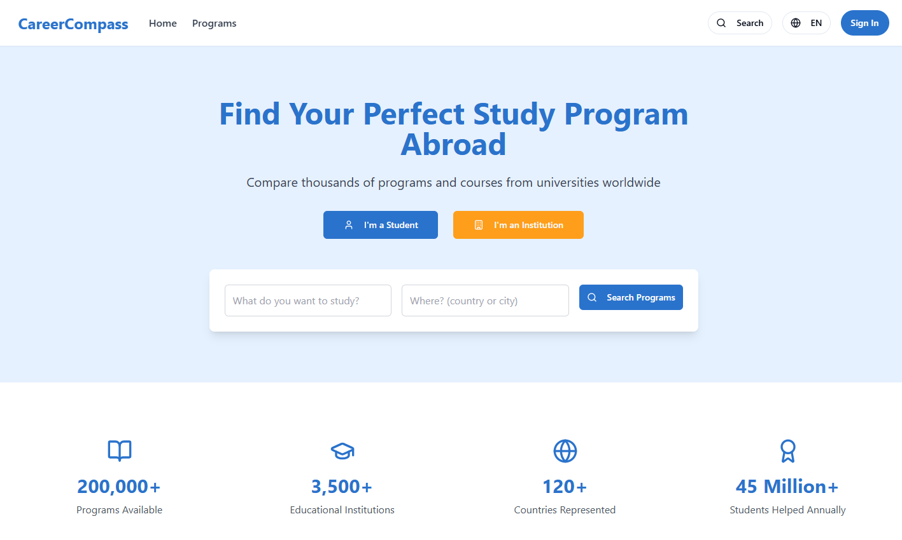
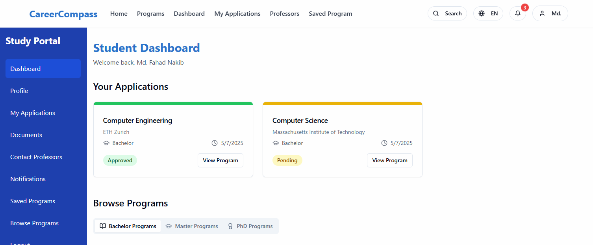

# 🎓 CareerCompass

**CareerCompass** is a smart web platform that helps students find and apply for higher education programs abroad. It bridges the gap between students, universities, professors, and admission officers — all in one centralized and user-friendly system.

 <!-- Replace with your logo if available -->

---

## 🌐 Overview

CareerCompass simplifies the study abroad journey by offering:

- 🎯 Personalized program exploration
- ✍️ Guided, step-by-step application process
- 📊 Real-time application status tracking
- 🏫 University program and scholarship management
- 👨‍🏫 Direct support from professors and admission officers
- 🔐 Secure system management by administrators

---

## 👥 User Roles & Features

### 🎓 Students
- Explore bachelor's, master's, and PhD programs
- Filter by country, subject, or university
- Apply through a guided step-by-step interface
- Communicate directly with professors and officers
- Track application and visa status

### 🏛️ Universities
- Register and maintain institutional profiles
- Manage available programs and scholarships
- Review and manage student applications
- Communicate with potential students

### 👨‍🏫 Professors & Admission Officers
- View and respond to student queries
- Offer guidance and feedback
- Recommend suitable programs

### 🛡️ System Admins
- Verify user identities and institutional registrations
- Maintain security and integrity of platform data
- Manage user access and permissions

---

## 📸 User Interface Previews

| Role | Feature | UI Preview |
|------|---------|------------|
| Student |Front Page ||
| Student | Student Dashboard |  |
| Student | Student Profile |  |
| Student | Students Applications Dashboard |  |
| Student | University Portal |  |
| Student | Professor Interface |  |
| Student | Admin Panel |  |

> 📌 *Note: Replace the image paths with your actual screenshots.*

---

## 🛠️ Tech Stack

- **Frontend:** HTML, CSS, JavaScript / React / Tailwind
- **Backend:** Node.js / Express / Django / PHP (choose accordingly)
- **Database:** MongoDB / MySQL / PostgreSQL
- **Authentication:** JWT / OAuth
- **Hosting:** Vercel / Netlify / Heroku / AWS

---

## 🚀 Getting Started

### Prerequisites

- Node.js / Python installed
- Database setup (e.g., MongoDB or MySQL)
- Git & GitHub

### Installation

```bash
git clone https://github.com/yourusername/careercompass.git
cd careercompass
npm install   # or pip install -r requirements.txt (if using Python)
