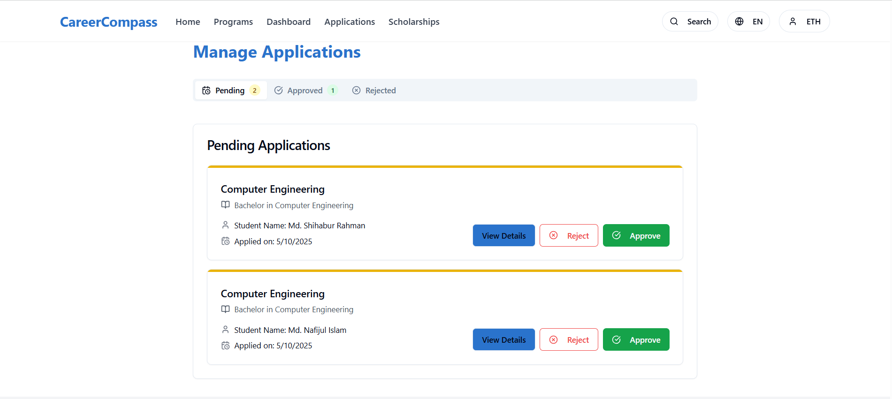
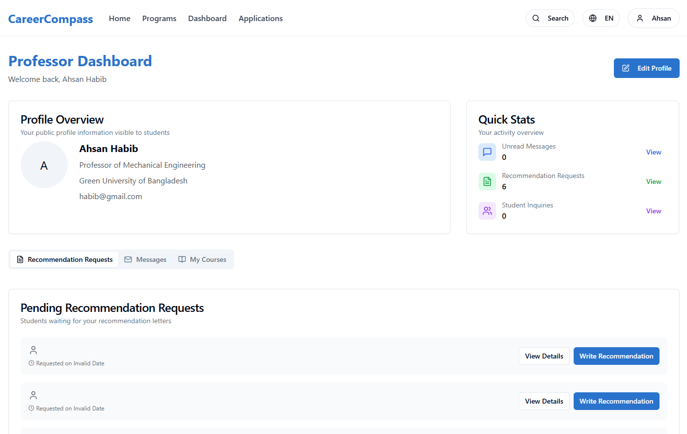
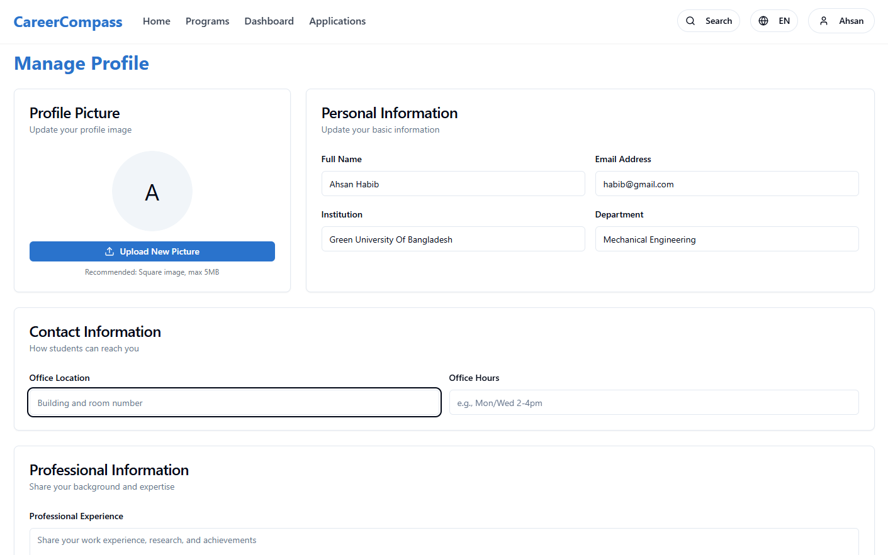

# CareerCompass

**CareerCompass** is a smart web platform that helps students find and apply for higher education programs abroad. It bridges the gap between students, universities, professors, and admission officers — all in one centralized and user-friendly system.

---

## User Roles & Features

### Students
- Explore bachelor's, master's, and PhD programs
- Filter by country, subject, or university
- Apply through a guided step-by-step interface
- Communicate directly with professors and officers
- Track application and visa status

### Universities
- Register and maintain institutional profiles
- Manage available programs and scholarships
- Review and manage student applications
- Communicate with potential students

### Professors & Admission Officers
- View and respond to student queries
- Offer guidance and feedback
- Recommend suitable programs

### System Admins
- Verify user identities and institutional registrations
- Maintain security and integrity of platform data
- Manage user access and permissions

---

## User Interface Previews

| Role | Feature | UI Preview |
|------|---------|------------|
| Student |Front Page ||
| Student | Student Dashboard |  |
| Student | Searchin Program |  |
| Student | Saved Programs |  |
| Student | View Program |  |
| Student | Application Form |  |
| University | Dashboard |  |
| University | Scholarship Management |  |
| University | Manage Applications |  |
| University | Add New Program |  |
| University | Students Application |  |
| Professor | Dashboard |  |
| Professor | Profile Management |  |
| System Admin | Dashboard |  |
| System Admin | Register University |  |
| System Admin | Revoke Approval |  |

---

## Tech Stack

- **Frontend:** React
- **Backend:** Node.js, Express 
- **Database:** MySQL 
- **Authentication:**OAuth

---
